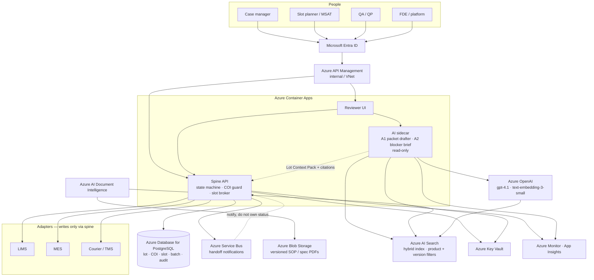
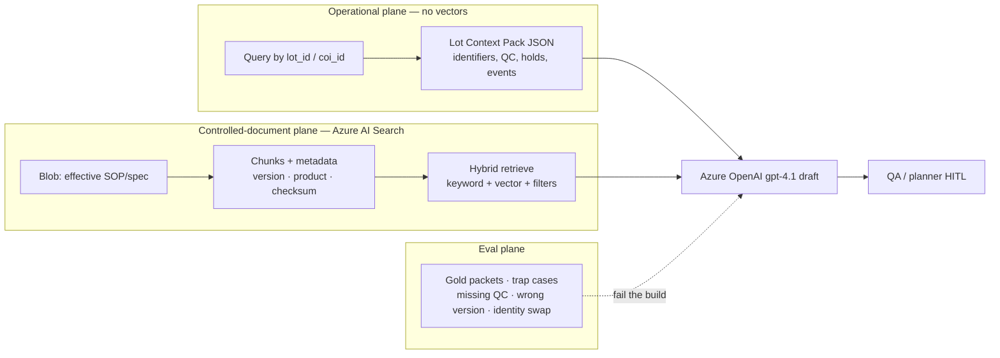
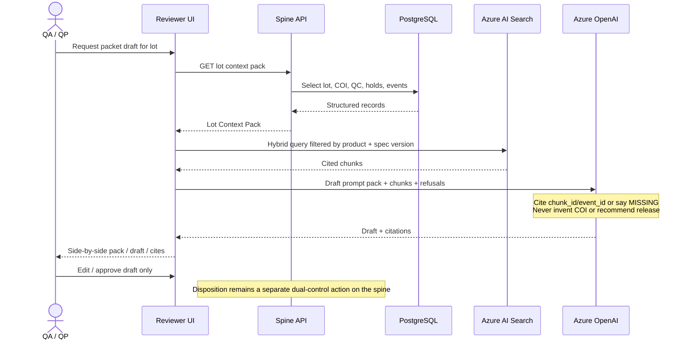

# CGT Patient-to-Batch — Complete replication & build context

This file is the **full briefing** from the FDE assessment workbench. Use it to:
1. **Replicate this workbench** (Next.js briefing app, sections 1–9 + Tree).
2. **Develop the target Azure orchestration application** (deterministic spine + read-only AI sidecar).

| Field | Value |
| --- | --- |
| Estate (inherited) | `AI_FDE_CGT_Patient_to_Batch_Orchestration` (EY Batch 2 capstone) |
| This repo | Assessment workbench — **not** a manufacturing execution system |
| Charter | Patient → released batch. Infusion / follow-up = new charter |
| Rubric | 21-stage AI FDE operating model |
| Evidence mode | Inferred until source zip is bound |
| Unbound maturity | **28/100** — Pre-charter brownfield — unsafe to connect to GxP systems |
| Never-events | Identity mismatch; unsupervised batch release |
| AI in the spine | **Forbidden.** Rules + human. AI is a read-only sidecar (A1/A2) |
| Cloud | Azure private landing zone (ADRs 0001–0003) |

**Do not invent zip CSV evidence.** `patients.csv`, `events.jsonl`, `baseline_kpis.csv` are not in this repository.

Canonical sources in code: `lib/seed-assessment.ts`, `lib/fde-stages.ts`, `lib/roadmap.ts`, `lib/mechanism.ts`, `lib/ai-implementation.ts`, `lib/architecture.ts`, `lib/presentation-qa.ts`, `docs/adr/`.

## 0. Two products this document specifies
### Product A — this workbench (already built)
- Next.js 16 + TypeScript + Tailwind 4 + shadcn/ui, IBM Plex + Source Serif.
- Dev server: `npm run dev` → http://127.0.0.1:43217
- Nav: 1 Summary, 2 Strengths, 3 Debt, 4 FDE map, 5 Roadmap, 6 AI fit, 7 Build AI, 8 Azure, 9 Q&A, Tree.
- Zip inspector binds `AI_FDE_CGT_Patient_to_Batch_Orchestration.zip` in the browser (JSZip) and rewrites stage evidence.
- Download complete repo: `/api/download-repo` → `capstone-sandeep.zip`.
- This file: `docs/COMPLETE_CONTEXT.md` and `/api/download-context`.
### Product B — target CGT orchestration app (to be built)
- Deterministic spine: Patient → Collection → Slot → Batch → human disposition.
- PostgreSQL is the only writer of lot status.
- Blocking COI at every handoff; dual-control QP release.
- AI sidecar: A1 packet drafter (RAG + gpt-4.1), A2 blocker brief. No write credentials.
- Azure: Entra, internal APIM, Container Apps, PostgreSQL Flexible Server, Service Bus notify-only, Blob + Document Intelligence, Azure AI Search, Azure OpenAI, Key Vault, Monitor.
### Hard constraints (copy into AGENTS.md / engineering rules)
- Do not put an LLM or LangGraph in the orchestration spine.
- Do not embed the living lot (patient, COI, QC) in a vector index.
- Do not treat manufacturing-complete as QA-released.
- Do not auto-merge conflicting identifiers.
- Do not grant the AI sidecar MES, TMS, Service Bus send, or PostgreSQL write.
- Do not expand to infusion without a new Stage 6 charter.
- Do not connect to a real plant until Stages 12, 15, 16, and 18 have bound evidence.
- Corrections are append-only audit events, never silent overwrites.

## 1. Summary

### Core problem statement
Autologous cell and gene therapy is make-to-order: one patient is one batch. The original problem this estate was built to solve is not ‘add AI to manufacturing’. It is to keep a single identity thread intact from the enrolled patient through collection and a manufacturing slot until a batch is QC’d and human-released — so the right product is made for the right patient in a calendar that cannot slip without destroying a living starting material. Traditional ERP/MES/LIMS stacks assume make-to-stock lots. They do not natively refuse a mismatched identity, hold an exclusive slot across site and plant, or assemble an inspection-ready chain when six to ten systems each hold a fragment of the same patient.

### Users (operations spine, not patient-facing)
| Role | Job to be done |
| --- | --- |
| Case manager / patient operations | Enroll, keep the calendar honest, and see blockers before a collection day is wasted. |
| Manufacturing planner / slot owner | Hold, sequence, and recover plant slots when collection or courier reality changes. |
| Manufacturing / MSAT | Start and run the patient-specific batch with the correct starting material and process version. |
| QA / QP | Release or reject with a complete COI/COC and QC packet; never from a chat summary alone. |
| Logistics coordinator | Move collected material and finished product inside time and temperature windows. |
| Forward deployed engineer / platform | Keep the orchestration spine truthful, observable, and change-controlled. |

### Initial scope
The artifact name is a tight charter: Patient to Batch. That is the high-value, high-risk spine — identity, slot, batch, disposition — not a full commercial CGT platform.

### Current brownfield (working hypothesis until bind)
As an inherited brownfield capstone, the estate is expected to have sprawled: extra UIs, notebooks, duplicate orchestrators, mock adapters that leaked into ‘the real path’, and AI/agent layers bolted onto a workflow that still lacks a guarded domain model. The workbench treats that sprawl as the default hypothesis until the zip is bound and the tree says otherwise.

### Unbound scorecard
| Metric | Value |
| --- | --- |
| Overall | 28 — Pre-charter brownfield — unsafe to connect to GxP systems |
| Evidence | unbound |
| Stack (until bind) | Unknown until archive bind; Expected: workflow/orchestrator + adapters + operator UI |
| Critical stages | S5 Frame Value, Risk Ceiling & Guardrails; S15 Enforce HITL, Identity & Exception Paths; S18 Harden for Production & Validation |

## 2. Strengths

### The problem is operationally real, not a demo in search of a user
Patient-to-batch orchestration is one of the few AI FDE problems where the accepted outcome is unambiguous: a living starting material becomes a released, identity-bound lot. That is stronger product sense than a generic ‘CGT copilot’.

**Evidence**
- Artifact name encodes the outcome boundary (patient → batch).
- CGT operating reality: one patient, one batch, non-substitutable lots.

### Scope fence is already implied
Stopping at batch (not infusion, REMS, or long-term follow-up) is the correct first vertical slice. Many failed CGT programs drown by trying to digitize the entire vein-to-vein network on day one.

**Evidence**
- Zip title: AI_FDE_CGT_Patient_to_Batch_Orchestration
- Industry split: orchestration hub vs treatment-center administration record.

### A 21-stage FDE rubric exists to judge the estate
The accompanying operating-model PDF is itself a strength of the engagement: it gives stage-gates, not vibes. This workbench encodes that model so future changes can be refused when they skip Discover or Prove.

**Evidence**
- 21 Stage AI_FDE_Operating_Model.pdf referenced as the mapping rubric.

### Capstone shape enables a strangler, not a rewrite-first panic
An inherited orchestrator with adapters is the right substrate for a strangler fig: freeze writes to COI, extract a state machine, replace one adapter at a time. That is cheaper and safer than a greenfield ‘platform’.

**Evidence**
- Named as orchestration (spine + participants), not as a single MES replacement.

## 3. Debt

### Identity is probably a field, not a control (high)
In brownfield CGT code, patient_id, din, lot, and coi_id are routinely copied across JSON payloads with string equality in the UI. That is not Chain of Identity. COI is a blocking control at every handoff, with dual identifiers, illegal-transition refusal, and an audit event.

**Evidence**
- No bound COI guard module.
- Stage 15 defaulted to Critical Failure until file evidence exists.

### Mechanism selection is likely inverted (high)
Prefixing the estate with AI_FDE predicts an agent/LLM in the coordination spine. Identity matching, slot exclusivity, and spec limits must be deterministic. Models may draft packets and propose recoveries. If the model is the orchestrator, the system cannot be validated.

**Evidence**
- Artifact naming: AI_FDE + Orchestration.
- FDE Stage 8 (smallest sufficient mechanism) is the design defect to confirm on bind.

### No verifier, no evals, no inspection-ready chain (high)
Without gold lots, identity-swap cases, and a queryable audit thread, this cannot enter a GxP-relevant pilot. QA cannot be asked to ‘trust the copilot’.

**Evidence**
- Stages 4, 12, 16 scored Missing in the unbound assessment.

### Production-hardening and secrets posture unknown — treat as unsafe (high)
Capstone trees commonly contain .env keys, open endpoints, pickle/eval, and no RBAC. Until the inspector says otherwise, do not point this at a real plant system.

**Evidence**
- Stage 18 Critical Failure by default.

### Dual orchestration spines and status spaghetti (medium)
The most common brownfield failure in this class is two writers to batch status (workflow engine + agent + notebook). The parent then diverges from children. Manual retry of QC does not resurrect the parent.

**Evidence**
- Stage 14 working hypothesis: overlapping conductors.

### HITL is probably a button, not a job (medium)
A reviewer who cannot see DIN, COI, slot, QC flags, and the rule that fired cannot override safely. Automation bias on a patient-specific lot is a safety event.

**Evidence**
- Stage 10 Missing.

### Critical findings (unbound)
#### Stage 5 Frame Value, Risk Ceiling & Guardrails is a critical gap

For autologous CGT, identity mismatch and unsupervised batch release are never-events. An AI FDE capstone named for patient-to-batch orchestration that does not present an explicit risk ceiling and write-forbid list is operating above a safe envelope even as a prototype. Source archive was referenced but not bound in this workspace. Status is inferred from artifact identity (AI_FDE_CGT_Patient_to_Batch_Orchestration) and CGT / FDE operating-model analysis. Drop the zip to replace inference with file-level evidence.

Evidence:
- Artifact: Capstone-EY-Batch 2 / AI_FDE_CGT_Patient_to_Batch_Orchestration.zip
- Artifact: 21 Stage AI_FDE_Operating_Model.pdf (operating-model rubric applied in this workbench)
#### Stage 15 Enforce HITL, Identity & Exception Paths is a critical gap

Chain of Identity is the load-bearing control of autologous CGT. Without bound evidence of blocking, deterministic COI checks and dual-control disposition, this stage is a critical failure by default — not a documentation gap. Source archive was referenced but not bound in this workspace. Status is inferred from artifact identity (AI_FDE_CGT_Patient_to_Batch_Orchestration) and CGT / FDE operating-model analysis. Drop the zip to replace inference with file-level evidence.

Evidence:
- Artifact: Capstone-EY-Batch 2 / AI_FDE_CGT_Patient_to_Batch_Orchestration.zip
- Artifact: 21 Stage AI_FDE_Operating_Model.pdf (operating-model rubric applied in this workbench)
#### Stage 18 Harden for Production & Validation is a critical gap

GxP-relevant functions (identity, disposition) plus typical capstone patterns (secrets in env files, no auth, unpinned ‘latest’ models) put production-hardening in critical failure until disproven. Do not connect this estate to a real MES. Source archive was referenced but not bound in this workspace. Status is inferred from artifact identity (AI_FDE_CGT_Patient_to_Batch_Orchestration) and CGT / FDE operating-model analysis. Drop the zip to replace inference with file-level evidence.

Evidence:
- Artifact: Capstone-EY-Batch 2 / AI_FDE_CGT_Patient_to_Batch_Orchestration.zip
- Artifact: 21 Stage AI_FDE_Operating_Model.pdf (operating-model rubric applied in this workbench)

## 4. FDE map (21 stages)
Scoring: Mature=100, Needs Improvement=45, Missing=15, Critical Failure=0. Overall is the mean.

Phases: Discover & Frame 1–6 · Design the Change 7–12 · Build & Prove 13–17 · Launch & Operate 18–21.

### Discover & Frame (1–6)

#### S01 Inherit & Reconcile — Needs Improvement
**Question:** What was sold or inherited, what actually exists, who owns the boundary, and what must not be changed yet?

**CGT lens:** Confirm whether the estate is patient-to-batch only, or has sprawled into full vein-to-vein (infusion, follow-up, commercial slot market). Freeze Chain of Identity writes until the model is proven.

**Exit criteria**
- Engagement reframe names the operational outcome, not the technology.
- Known source artifacts, owners, and access constraints are inventoried.
- A freeze list exists for identity, release, and safety-critical paths.

**Expected artifacts**
- README / problem statement
- engagement brief
- source inventory

**Unbound assessment**
The estate is clearly an inherited CGT orchestration capstone, not a greenfield product. The name encodes the original outcome (patient → batch) but there is no engagement reframe, freeze list, or owner map in the unbound workspace. Source archive was referenced but not bound in this workspace. Status is inferred from artifact identity (AI_FDE_CGT_Patient_to_Batch_Orchestration) and CGT / FDE operating-model analysis. Drop the zip to replace inference with file-level evidence.

**Evidence cited**
- Artifact: Capstone-EY-Batch 2 / AI_FDE_CGT_Patient_to_Batch_Orchestration.zip
- Artifact: 21 Stage AI_FDE_Operating_Model.pdf (operating-model rubric applied in this workbench)

**Bind probes** — paths: readme, docs/, problem, brief, inherit. Content: problem statement, inherited, brownfield, capstone.

#### S02 Observe the Work — Needs Improvement
**Question:** How does the work actually happen, including the exceptions, workarounds, and tribal knowledge that never made the SOP?

**CGT lens:** Walk enrollment → eligibility → apheresis booking → collection → courier handoff → manufacturing slot → batch start → in-process QC → disposition → shipment. Capture what happens when a slot slips or a bag is delayed.

**Exit criteria**
- A current-state journey is evidenced from operators, not from a slide.
- Happy-path and at least the top exception classes are named.

**Expected artifacts**
- process map / BPMN
- observation notes
- exception catalog

**Unbound assessment**
The intended journey is reconstructable from the CGT domain (enrollment, collection, slot, batch, QC) but there is no operator observation log or exception catalog bound to source. Brownfield CGT systems almost always hide the real work in email and spreadsheets around the code. Source archive was referenced but not bound in this workspace. Status is inferred from artifact identity (AI_FDE_CGT_Patient_to_Batch_Orchestration) and CGT / FDE operating-model analysis. Drop the zip to replace inference with file-level evidence.

**Evidence cited**
- Artifact: Capstone-EY-Batch 2 / AI_FDE_CGT_Patient_to_Batch_Orchestration.zip
- Artifact: 21 Stage AI_FDE_Operating_Model.pdf (operating-model rubric applied in this workbench)

**Bind probes** — paths: process, workflow, bpmn, journey, sop. Content: apheresis, vein-to-vein, exception, workaround.

#### S03 Map Actors, Systems & Exceptions — Needs Improvement
**Question:** Who acts, which systems of record they touch, and where identity, custody, and schedule diverge?

**CGT lens:** Expect 6–10 systems: EHR/ordering, case management, LIMS, MES, ERP/slot, courier TMS, quality/QMS, and a treatment-center scheduler. The orchestration layer is not a twelfth SOP spreadsheet.

**Exit criteria**
- Actor × system × record map exists for patient, collection, slot, batch, and shipment.
- Exception set is classified by detectability and blast radius.

**Expected artifacts**
- system landscape
- adapter inventory
- RACI / actor map

**Unbound assessment**
A patient-to-batch orchestrator implies adapters to case, collection, slot, and manufacturing systems. Until the zip is bound we cannot see whether those are real ports or copy-pasted stubs. Expect overlapping conductors and mock clients — the usual brownfield signature. Source archive was referenced but not bound in this workspace. Status is inferred from artifact identity (AI_FDE_CGT_Patient_to_Batch_Orchestration) and CGT / FDE operating-model analysis. Drop the zip to replace inference with file-level evidence.

**Evidence cited**
- Artifact: Capstone-EY-Batch 2 / AI_FDE_CGT_Patient_to_Batch_Orchestration.zip
- Artifact: 21 Stage AI_FDE_Operating_Model.pdf (operating-model rubric applied in this workbench)

**Bind probes** — paths: adapter, integration, client, connector, systems. Content: lims, mes, ehr, courier, qms, fhir.

#### S04 Establish Baseline & Verifier — Missing
**Question:** What is the current performance of the work, and who/what can independently say the outcome is true?

**CGT lens:** Baselines that matter: vein-to-vein cycle time, slot utilization, identity-mismatch rate, discarded batches, QA cycle time, inspection reconstruction time. The verifier for a released batch is QA/QP plus the COI/COC packet — not the model’s confidence score.

**Exit criteria**
- Baseline metrics are measured or explicitly unmeasured with a plan.
- A verifier is named that does not depend on the system under change.

**Expected artifacts**
- KPI baseline
- verifier definition
- gold cases

**Unbound assessment**
No baseline packet (cycle time, discarded lots, identity-mismatch rate, QA packet time) is visible without source. There is no independent verifier definition. A demo script is not a baseline. Source archive was referenced but not bound in this workspace. Status is inferred from artifact identity (AI_FDE_CGT_Patient_to_Batch_Orchestration) and CGT / FDE operating-model analysis. Drop the zip to replace inference with file-level evidence.

**Evidence cited**
- Artifact: Capstone-EY-Batch 2 / AI_FDE_CGT_Patient_to_Batch_Orchestration.zip
- Artifact: 21 Stage AI_FDE_Operating_Model.pdf (operating-model rubric applied in this workbench)

**Bind probes** — paths: metrics, kpi, baseline, gold, eval. Content: cycle time, slot utilization, baseline, verifier.

#### S05 Frame Value, Risk Ceiling & Guardrails — Critical Failure
**Question:** What value is attributable, what failure is intolerable, and which actions are forbidden without a human?

**CGT lens:** Value is fewer lost slots, fewer discarded patient lots, faster QA packet assembly, and inspection-ready chains. Guardrails: no autonomous COI mutation, no autonomous batch disposition, no unsupervised external communication to sites or couriers.

**Exit criteria**
- Value hypothesis is falsifiable and owned.
- Risk ceiling names identity mismatch, wrong-patient infusion, and unsupervised batch release as never-events.

**Expected artifacts**
- value case
- risk register
- guardrail list

**Unbound assessment**
For autologous CGT, identity mismatch and unsupervised batch release are never-events. An AI FDE capstone named for patient-to-batch orchestration that does not present an explicit risk ceiling and write-forbid list is operating above a safe envelope even as a prototype. Source archive was referenced but not bound in this workspace. Status is inferred from artifact identity (AI_FDE_CGT_Patient_to_Batch_Orchestration) and CGT / FDE operating-model analysis. Drop the zip to replace inference with file-level evidence.

**Evidence cited**
- Artifact: Capstone-EY-Batch 2 / AI_FDE_CGT_Patient_to_Batch_Orchestration.zip
- Artifact: 21 Stage AI_FDE_Operating_Model.pdf (operating-model rubric applied in this workbench)

**Bind probes** — paths: risk, threat, guardrail, value, roi. Content: never event, phi, gxp, hipaa, 21 cfr, guardrail.

#### S06 Charter the Workflow — Needs Improvement
**Question:** Is this workflow worth changing now, and what is the accepted outcome that proves it?

**CGT lens:** Charter the accepted outcome as: a patient identity is bound to a manufacturing batch with an intact COI/COC chain and a human-released disposition. Do not charter ‘an AI platform for CGT’.

**Exit criteria**
- Charter names user, interface, decision, inputs, action, outcome, and stop conditions.
- Out-of-scope is explicit (typically infusion and long-term follow-up if the name is patient-to-batch).

**Expected artifacts**
- workflow charter
- ADR-0001
- scope fence

**Unbound assessment**
The zip name is a de-facto charter: bind a patient to a manufacturing batch. That is tighter and healthier than ‘platform for CGT’. It is still not a signed charter with stop conditions, out-of-scope (infusion/follow-up), and an accepted outcome. Source archive was referenced but not bound in this workspace. Status is inferred from artifact identity (AI_FDE_CGT_Patient_to_Batch_Orchestration) and CGT / FDE operating-model analysis. Drop the zip to replace inference with file-level evidence.

**Evidence cited**
- Artifact: Capstone-EY-Batch 2 / AI_FDE_CGT_Patient_to_Batch_Orchestration.zip
- Artifact: 21 Stage AI_FDE_Operating_Model.pdf (operating-model rubric applied in this workbench)

**Bind probes** — paths: charter, adr, scope, decision-record. Content: in scope, out of scope, accepted outcome, charter.

### Design the Change (7–12)

#### S07 Prepare the Four Data Planes — Needs Improvement
**Question:** Are operational, context, evaluation, and feedback sources fit for this decision and affordable to operate?

**CGT lens:** Operational: patient, collection, slot, batch, QC results. Context: SOPs, product specs, slot calendars. Evaluation: historical lots with known dispositions. Feedback: QA overrides, deviations, temperature excursions. Synthetic fixtures are acceptable in exploration; they are not a production data plane.

**Exit criteria**
- Each plane has a source of authority, quality threshold, and failure behavior.
- PHI/PII handling and retention are explicit.

**Expected artifacts**
- data-readiness note
- schemas / fixtures
- lineage note

**Unbound assessment**
Capstone orchestrators typically ship synthetic patients and happy-path fixtures. That is a valid exploration data plane. It is not operational, evaluation, or feedback data. PHI handling and retention are unknown until files are bound. Source archive was referenced but not bound in this workspace. Status is inferred from artifact identity (AI_FDE_CGT_Patient_to_Batch_Orchestration) and CGT / FDE operating-model analysis. Drop the zip to replace inference with file-level evidence.

**Evidence cited**
- Artifact: Capstone-EY-Batch 2 / AI_FDE_CGT_Patient_to_Batch_Orchestration.zip
- Artifact: 21 Stage AI_FDE_Operating_Model.pdf (operating-model rubric applied in this workbench)

**Bind probes** — paths: schema, fixture, seed, data/, models/, prisma. Content: patient_id, batch_id, coi, phi, pydantic, zod.

#### S08 Select the Smallest Sufficient Mechanism — Needs Improvement
**Question:** Which steps belong in deterministic software, which in retrieval or a model, and which must stay human?

**CGT lens:** COI equality, ISBT-128 parse, slot exclusivity, temperature-excursion thresholds, and spec-limit checks are software. Narrative deviation summaries, packet drafting, and schedule-recovery options may be model-assisted. Batch release remains human.

**Exit criteria**
- A mechanism record exists per workflow step.
- Identity matching, slot conflict, and disposition gates are deterministic unless a documented exception exists.

**Expected artifacts**
- intelligence-selection record
- rules vs model matrix

**Unbound assessment**
The ‘AI_FDE’ prefix strongly suggests model/agent involvement in a workflow that should be majority deterministic (COI, slot exclusivity, spec limits). Mechanism selection is likely inverted: LLM in the spine, rules at the edge. That is the wrong default for GxP identity. Source archive was referenced but not bound in this workspace. Status is inferred from artifact identity (AI_FDE_CGT_Patient_to_Batch_Orchestration) and CGT / FDE operating-model analysis. Drop the zip to replace inference with file-level evidence.

**Evidence cited**
- Artifact: Capstone-EY-Batch 2 / AI_FDE_CGT_Patient_to_Batch_Orchestration.zip
- Artifact: 21 Stage AI_FDE_Operating_Model.pdf (operating-model rubric applied in this workbench)

**Bind probes** — paths: agent, langchain, langgraph, crewai, rules, policy. Content: llm, prompt, deterministic, state machine, rules engine.

#### S09 Design the Domain & State Model — Needs Improvement
**Question:** What are the canonical entities and legal state transitions for patient, collection, slot, and batch?

**CGT lens:** Canonical thread: Patient → Enrollment → Collection (DIN) → COI identifier → Manufacturing order → Batch/lot → QC suite → Disposition → Qualified shipment. One patient-specific batch cannot be reassigned. State transitions are the product.

**Exit criteria**
- Entities, identifiers, and transitions are explicit and guarded.
- Illegal transitions cannot be performed by an adapter, UI, or agent.

**Expected artifacts**
- domain model
- state machine
- identifier policy

**Unbound assessment**
Patient, batch, and slot almost certainly exist as records. A guarded state machine with illegal-transition refusal is what is usually missing in brownfield CGT tools, which store status as strings and let every adapter write them. Source archive was referenced but not bound in this workspace. Status is inferred from artifact identity (AI_FDE_CGT_Patient_to_Batch_Orchestration) and CGT / FDE operating-model analysis. Drop the zip to replace inference with file-level evidence.

**Evidence cited**
- Artifact: Capstone-EY-Batch 2 / AI_FDE_CGT_Patient_to_Batch_Orchestration.zip
- Artifact: 21 Stage AI_FDE_Operating_Model.pdf (operating-model rubric applied in this workbench)

**Bind probes** — paths: domain, state, machine, entities, models. Content: state machine, transition, chain of identity, enrollment, disposition.

#### S10 Design the Human–Agent Operating Model — Missing
**Question:** Who prepares, who checks, who decides, and how does a reviewer actually intervene in time?

**CGT lens:** Agents: ingest, normalize, check completeness, draft packets, propose slot recovery. Humans: eligibility nuance, deviation judgment, QP/QA release, site communication. A reviewer who only clicks ‘approve’ on a wall of text is not a control.

**Exit criteria**
- Agent roles and human roles are separated with evidence presented to the reviewer.
- Reviewer time, authority, and override path are designed, not implied.

**Expected artifacts**
- RACI for digital teammates
- approval UX
- escalation matrix

**Unbound assessment**
No evidence of a designed reviewer job (evidence packet, time, authority, override). AI FDE systems in this class often add a chat UI and call it HITL. Source archive was referenced but not bound in this workspace. Status is inferred from artifact identity (AI_FDE_CGT_Patient_to_Batch_Orchestration) and CGT / FDE operating-model analysis. Drop the zip to replace inference with file-level evidence.

**Evidence cited**
- Artifact: Capstone-EY-Batch 2 / AI_FDE_CGT_Patient_to_Batch_Orchestration.zip
- Artifact: 21 Stage AI_FDE_Operating_Model.pdf (operating-model rubric applied in this workbench)

**Bind probes** — paths: approval, review, hitl, human, inbox. Content: human in the loop, approve, override, escalat.

#### S11 Design Integration Contracts & Tool Permissions — Needs Improvement
**Question:** What is the contract at each system boundary, and what power does each tool actually have?

**CGT lens:** Prefer events for state changes (collection completed, slot held, batch in-process, excursion detected) over nightly files. Idempotency keys on slot holds and batch start. Never grant an agent unbounded MES or courier credentials.

**Exit criteria**
- Adapters are ports with explicit allowlists, idempotency, and timeouts.
- Write tools are least-privilege and reversible or compensating.

**Expected artifacts**
- OpenAPI / events
- adapter ports
- permission matrix

**Unbound assessment**
Expect mock HTTP clients and implicit JSON blobs rather than versioned contracts, idempotent slot holds, and least-privilege tools. Confirm on bind. Source archive was referenced but not bound in this workspace. Status is inferred from artifact identity (AI_FDE_CGT_Patient_to_Batch_Orchestration) and CGT / FDE operating-model analysis. Drop the zip to replace inference with file-level evidence.

**Evidence cited**
- Artifact: Capstone-EY-Batch 2 / AI_FDE_CGT_Patient_to_Batch_Orchestration.zip
- Artifact: 21 Stage AI_FDE_Operating_Model.pdf (operating-model rubric applied in this workbench)

**Bind probes** — paths: openapi, asyncapi, proto, contract, ports. Content: idempotency, timeout, retry, allowlist, webhook.

#### S12 Design Evaluation, Safety & Audit — Missing
**Question:** How will we know the workflow is right, safe, and reconstructable under inspection?

**CGT lens:** Inspection readiness is an integration property. A complete patient chain must be queryable, not reconstructed from email. Safety evals must include near-miss identity swaps and stale slot data.

**Exit criteria**
- Eval cases cover identity mismatch, slot collision, missing QC, and excursion.
- Audit design is tamper-evident and time-aligned across systems.

**Expected artifacts**
- eval plan
- failure taxonomy
- audit schema

**Unbound assessment**
No eval plan, identity-swap cases, or tamper-evident audit schema is visible. Inspection readiness cannot be inferred from a capstone name. Source archive was referenced but not bound in this workspace. Status is inferred from artifact identity (AI_FDE_CGT_Patient_to_Batch_Orchestration) and CGT / FDE operating-model analysis. Drop the zip to replace inference with file-level evidence.

**Evidence cited**
- Artifact: Capstone-EY-Batch 2 / AI_FDE_CGT_Patient_to_Batch_Orchestration.zip
- Artifact: 21 Stage AI_FDE_Operating_Model.pdf (operating-model rubric applied in this workbench)

**Bind probes** — paths: eval, golden, audit, safety, redteam. Content: audit trail, alcoa, eval case, failure taxonomy.

### Build & Prove (13–17)

#### S13 Build the Vertical Slice — Needs Improvement
**Question:** Does one end-to-end slice exercise the real boundaries: identity, slot, batch, human release?

**CGT lens:** The slice is not a chatbot that explains CGT. It is a case that binds a patient to a collection, holds a slot, opens a batch, attaches QC, and stops at a human disposition gate.

**Exit criteria**
- A single patient can be taken from enrollment to a (simulated) released batch.
- The slice uses the real domain model, not a demo-only happy path.

**Expected artifacts**
- walking skeleton
- end-to-end script / demo path

**Unbound assessment**
The artifact exists as a named patient-to-batch orchestrator, so some walking path was built. Whether that path exercises identity, slot conflict, and a human disposition gate — versus a scripted happy path — is the question to answer on bind. Source archive was referenced but not bound in this workspace. Status is inferred from artifact identity (AI_FDE_CGT_Patient_to_Batch_Orchestration) and CGT / FDE operating-model analysis. Drop the zip to replace inference with file-level evidence.

**Evidence cited**
- Artifact: Capstone-EY-Batch 2 / AI_FDE_CGT_Patient_to_Batch_Orchestration.zip
- Artifact: 21 Stage AI_FDE_Operating_Model.pdf (operating-model rubric applied in this workbench)

**Bind probes** — paths: main, app, orchestrat, demo, e2e. Content: end-to-end, vertical slice, patient to batch.

#### S14 Orchestrate Tools, Systems & Workflow — Needs Improvement
**Question:** Is there one orchestration spine, or several overlapping conductors fighting over state?

**CGT lens:** Airflow, Celery, LangGraph, custom loops, and cron must not all believe they own the batch. The spine should re-sync child status (manual retry of a QC job should not leave the parent failed forever).

**Exit criteria**
- A single state owner exists for the patient–batch thread.
- Child work (QC, courier, slot) is monitored continuously, not fire-and-forget.

**Expected artifacts**
- orchestrator
- workflow definitions
- correlation IDs

**Unbound assessment**
Brownfield orchestration estates in this class commonly accumulate a second conductor (notebook, cron, agent graph, Celery) that also mutates batch status. Until bind, treat dual-spine as the working hypothesis. Source archive was referenced but not bound in this workspace. Status is inferred from artifact identity (AI_FDE_CGT_Patient_to_Batch_Orchestration) and CGT / FDE operating-model analysis. Drop the zip to replace inference with file-level evidence.

**Evidence cited**
- Artifact: Capstone-EY-Batch 2 / AI_FDE_CGT_Patient_to_Batch_Orchestration.zip
- Artifact: 21 Stage AI_FDE_Operating_Model.pdf (operating-model rubric applied in this workbench)

**Bind probes** — paths: airflow, temporal, prefect, celery, langgraph, dag. Content: orchestrat, workflow, correlation, saga, state.

#### S15 Enforce HITL, Identity & Exception Paths — Critical Failure
**Question:** Can the system refuse an identity mismatch, and can a human recover a real exception without breaking the chain?

**CGT lens:** A mismatched DIN / COI / lot must stop the process immediately, not alert later. Manufacturing failure on a patient-specific lot restarts from collection, not from a cloned batch ID. Dual control on disposition.

**Exit criteria**
- COI checks are deterministic and blocking.
- Exception paths (slot slip, excursion, manufacturing failure) have compensating actions.

**Expected artifacts**
- COI guard
- exception handlers
- approval records

**Unbound assessment**
Chain of Identity is the load-bearing control of autologous CGT. Without bound evidence of blocking, deterministic COI checks and dual-control disposition, this stage is a critical failure by default — not a documentation gap. Source archive was referenced but not bound in this workspace. Status is inferred from artifact identity (AI_FDE_CGT_Patient_to_Batch_Orchestration) and CGT / FDE operating-model analysis. Drop the zip to replace inference with file-level evidence.

**Evidence cited**
- Artifact: Capstone-EY-Batch 2 / AI_FDE_CGT_Patient_to_Batch_Orchestration.zip
- Artifact: 21 Stage AI_FDE_Operating_Model.pdf (operating-model rubric applied in this workbench)

**Bind probes** — paths: coi, identity, custody, exception, deviation. Content: chain of identity, chain of custody, isbt, mismatch, deviation.

#### S16 Instrument Evals, Tests & Observability — Missing
**Question:** Can we replay a case, see why a decision was made, and catch regressions before a patient lot is touched?

**CGT lens:** Every material action carries patient/batch correlation IDs with PHI minimized. Prompt, model, tool, and policy versions are recorded. An eval suite fails the build on identity-swap cases.

**Exit criteria**
- Unit, contract, and scenario tests exist for identity and disposition.
- Traces, structured logs, and eval scores are first-class.

**Expected artifacts**
- tests/
- eval harness
- logging / tracing

**Unbound assessment**
Capstone brownfield trees in this program family rarely include an eval harness, contract tests, or structured traces with correlation IDs. Assume absent until the archive proves otherwise. Source archive was referenced but not bound in this workspace. Status is inferred from artifact identity (AI_FDE_CGT_Patient_to_Batch_Orchestration) and CGT / FDE operating-model analysis. Drop the zip to replace inference with file-level evidence.

**Evidence cited**
- Artifact: Capstone-EY-Batch 2 / AI_FDE_CGT_Patient_to_Batch_Orchestration.zip
- Artifact: 21 Stage AI_FDE_Operating_Model.pdf (operating-model rubric applied in this workbench)

**Bind probes** — paths: test, spec, pytest, otel, logging, eval. Content: opentelemetry, structlog, prometheus, assert, unittest.

#### S17 Run a Bounded Pilot — Missing
**Question:** Can named users get repeatable value under a documented envelope without unsupervised writes to MES or release?

**CGT lens:** Pilot on historical or shadow lots first, then a named set of non-pivotal cases. The envelope excludes autonomous courier booking and autonomous disposition. Measure override rate and packet assembly time.

**Exit criteria**
- Pilot users, dates, included tasks, and stop conditions are written down.
- Support ownership and fallback to the as-is process exist.

**Expected artifacts**
- pilot protocol
- feature flags
- feedback channel

**Unbound assessment**
No pilot protocol, named users, or shadow-mode flag is visible. A local demo is not a pilot. Source archive was referenced but not bound in this workspace. Status is inferred from artifact identity (AI_FDE_CGT_Patient_to_Batch_Orchestration) and CGT / FDE operating-model analysis. Drop the zip to replace inference with file-level evidence.

**Evidence cited**
- Artifact: Capstone-EY-Batch 2 / AI_FDE_CGT_Patient_to_Batch_Orchestration.zip
- Artifact: 21 Stage AI_FDE_Operating_Model.pdf (operating-model rubric applied in this workbench)

**Bind probes** — paths: pilot, flag, shadow, staging. Content: pilot, feature flag, shadow mode, dry-run.

### Launch & Operate (18–21)

#### S18 Harden for Production & Validation — Critical Failure
**Question:** Can this run in a GxP-relevant environment with identity, secrets, change control, and a validation story?

**CGT lens:** COI functions are high process risk and need scripted tests. AI-drafted packets remain under the regulated company’s responsibility. Change control covers prompts, tools, and ontologies — not only application code.

**Exit criteria**
- Secrets are not in source. AuthN/Z is real. Dependencies are pinned.
- CSV/validation strategy exists for GxP-relevant functions (COI, disposition).

**Expected artifacts**
- Docker / IaC
- secret management
- validation / GAMP note

**Unbound assessment**
GxP-relevant functions (identity, disposition) plus typical capstone patterns (secrets in env files, no auth, unpinned ‘latest’ models) put production-hardening in critical failure until disproven. Do not connect this estate to a real MES. Source archive was referenced but not bound in this workspace. Status is inferred from artifact identity (AI_FDE_CGT_Patient_to_Batch_Orchestration) and CGT / FDE operating-model analysis. Drop the zip to replace inference with file-level evidence.

**Evidence cited**
- Artifact: Capstone-EY-Batch 2 / AI_FDE_CGT_Patient_to_Batch_Orchestration.zip
- Artifact: 21 Stage AI_FDE_Operating_Model.pdf (operating-model rubric applied in this workbench)

**Bind probes** — paths: dockerfile, k8s, terraform, auth, vault, validation. Content: gamp, 21 cfr part 11, oauth, rbac, secret.

#### S19 Launch, Cut Over & Recover — Missing
**Question:** Can the exact release be contained, rolled back, and recovered without losing the identity chain?

**CGT lens:** You cannot ‘roll back’ a collected bag. Recovery is compensating action: hold slot, notify site, open deviation. Launch must be lot-aware, not just traffic-aware.

**Exit criteria**
- Runbook, rollback, and compensating actions have been exercised.
- Cutover preserves in-flight lots.

**Expected artifacts**
- runbook
- rollback plan
- release record

**Unbound assessment**
No runbook or lot-aware rollback/compensating action is visible. You cannot roll back a collected bag; the absence of compensating-action design is a launch blocker. Source archive was referenced but not bound in this workspace. Status is inferred from artifact identity (AI_FDE_CGT_Patient_to_Batch_Orchestration) and CGT / FDE operating-model analysis. Drop the zip to replace inference with file-level evidence.

**Evidence cited**
- Artifact: Capstone-EY-Batch 2 / AI_FDE_CGT_Patient_to_Batch_Orchestration.zip
- Artifact: 21 Stage AI_FDE_Operating_Model.pdf (operating-model rubric applied in this workbench)

**Bind probes** — paths: runbook, rollback, release, cutover, playbook. Content: rollback, runbook, cutover, incident.

#### S20 Transfer Ownership & Hypercare — Missing
**Question:** Can a receiving team operate, change, and support this without the original FDE on the critical path?

**CGT lens:** Owners are QA, manufacturing planning, and a platform engineer — not ‘the intern who ran the notebook’. Hypercare watches in-flight autologous lots, not just HTTP error rates.

**Exit criteria**
- Named business and technical owners exist.
- Support hours, escalation, and a trained backup are real.

**Expected artifacts**
- handoff pack
- on-call
- training record

**Unbound assessment**
No receiving owner, on-call, or training record. The FDE who inherited this is still the bus factor of one. Source archive was referenced but not bound in this workspace. Status is inferred from artifact identity (AI_FDE_CGT_Patient_to_Batch_Orchestration) and CGT / FDE operating-model analysis. Drop the zip to replace inference with file-level evidence.

**Evidence cited**
- Artifact: Capstone-EY-Batch 2 / AI_FDE_CGT_Patient_to_Batch_Orchestration.zip
- Artifact: 21 Stage AI_FDE_Operating_Model.pdf (operating-model rubric applied in this workbench)

**Bind probes** — paths: handoff, oncall, operations, support, training. Content: owner, on-call, hypercare, raci.

#### S21 Operate, Productize, Expand or Retire — Missing
**Question:** Should this service continue, generalize, expand beyond patient-to-batch, or be retired?

**CGT lens:** Productize the COI service, slot broker, and packet assembler — not a customer-specific Streamlit. Expansion into infusion and follow-up is a new charter, not a silent scope creep. Retire shadow orchestrators.

**Exit criteria**
- Service review covers value, adoption, safety, cost, and residual risk.
- Productization path (reusable adapters, shared COI service) is explicit or declined.

**Expected artifacts**
- service review
- SLO / cost
- retirement criteria

**Unbound assessment**
No service review, SLO, productization path, or retirement of shadow tools. Expansion beyond patient-to-batch would be scope creep, not operate-stage maturity. Source archive was referenced but not bound in this workspace. Status is inferred from artifact identity (AI_FDE_CGT_Patient_to_Batch_Orchestration) and CGT / FDE operating-model analysis. Drop the zip to replace inference with file-level evidence.

**Evidence cited**
- Artifact: Capstone-EY-Batch 2 / AI_FDE_CGT_Patient_to_Batch_Orchestration.zip
- Artifact: 21 Stage AI_FDE_Operating_Model.pdf (operating-model rubric applied in this workbench)

**Bind probes** — paths: slo, dashboard, cost, retire, roadmap. Content: slo, productiz, retire, service review.

## 5. Roadmap

### W0 — Freeze & reframe
**Intent:** Stop the bleeding. Treat the inherited tree as a contaminated plant floor: freeze writes to identity and disposition, name owners, and re-charter the outcome as patient → released batch.

**Pattern:** Engagement reframe + write-freeze. No new features.

**Stage gates:** S1, S5, S6

**Outcomes**
- Signed charter: accepted outcome, out-of-scope (infusion/follow-up), stop conditions.
- Freeze list: COI, batch disposition, courier booking, MES start — no agent writes.
- Risk ceiling: identity mismatch and unsupervised release are never-events.
- Inventory of orchestrators, adapters, secrets, and notebooks that can mutate state.

### W1 — Extract the spine (strangler fig)
**Intent:** Put a guarded domain model in front of the brownfield. New reads and all writes go through a state machine; old UI and adapters are facades until they die.

**Pattern:** Strangler fig around Patient–Collection–Slot–Batch. Hexagonal ports for LIMS/MES/slot/courier.

**Stage gates:** S7, S8, S9, S11, S14

**Outcomes**
- Canonical entities and illegal-transition tests.
- One writer of batch status (retire the second conductor).
- Deterministic COI equality and slot exclusivity — models may not own these steps.
- Versioned adapter contracts with idempotency keys on slot hold and batch start.

### W2 — Make identity a control, HITL a job
**Intent:** Promote Chain of Identity from a column to a blocking control. Design the QA/planner review job so a human can refuse in time.

**Pattern:** Policy engine + dual-control disposition + evidence packet UI.

**Stage gates:** S10, S12, S15

**Outcomes**
- Blocking mismatch on DIN / COI / lot at every handoff.
- Reviewer packet: identifiers, slot, QC flags, rule that fired, source system, timestamp.
- Exception paths: slot slip, temperature excursion, manufacturing failure — compensating actions, not cloned batch IDs.
- Eval cases: identity swap, stale slot, missing QC, excursion.

### W3 — Prove, then envelope a pilot
**Intent:** Build the harness that makes the system falsifiable. Only then allow named users onto historical or shadow lots.

**Pattern:** Eval harness in CI + shadow mode + feature flags. No plant writes.

**Stage gates:** S13, S16, S17

**Outcomes**
- One vertical slice: enroll → collect → hold slot → open batch → QC attach → human disposition.
- Contract tests on adapters; identity scenario tests fail the build.
- Traces with correlation IDs; prompt/model/tool/policy versions recorded.
- Pilot protocol: users, dates, included tasks, fallback SOP, support owner.

### W4 — Harden, launch lot-aware, operate
**Intent:** Production is an operating commitment, not a deploy. Validate GxP-relevant functions, cut over without abandoning in-flight lots, and transfer ownership.

**Pattern:** GAMP-aligned CSV for COI/disposition; lot-aware cutover; productize COI/slot/packet, retire snowflakes.

**Stage gates:** S18, S19, S20, S21

**Outcomes**
- Secrets out of git; real authN/Z; pinned dependencies; change control for prompts and ontologies.
- Runbooks that compensate (hold slot, notify site, open deviation) rather than ‘restart the pod’.
- Named QA, planning, and platform owners; hypercare on in-flight autologous lots.
- Productize COI service, slot broker, packet assembler. Expansion to infusion requires a new charter.

### Governance

#### Stage-gates are real, not ceremonial
No build work without a charter (Stage 6). No plant integration without evals and blocking COI (Stages 12, 15, 16). No ‘pilot’ that is actually unbounded production (Stage 17). A skipped gate is how this estate degraded the first time.

#### Change control includes prompts, tools, and ontologies
A model swap, retrieval change, or policy edit can invalidate prior evidence. Treat those as system changes with regression evals. Code-only CAB is insufficient.

#### Separation of duties on disposition
The digital teammate may draft. QA/QP disposes. The same engineer must not be the only person who can both change the COI rule and approve the lot.

#### One spine, many adapters
New workflow engines are guilty until proven otherwise. A second writer to batch status is an incident, not a feature. Architecture review asks: who owns the thread?

#### PHI minimization and inspection readiness
Logs carry correlation IDs, not full clinical payloads. A complete patient chain must be a query. If reconstruction takes an afternoon of email, the operate stage has already failed.

#### Productization tax
Every engagement ends with an explicit keep / generalize / retire decision. Customer-specific Streamlit and notebooks are not assets unless they die on a date.

## 6. AI fit
### Verdict
**No. The patient-to-batch spine does not need AI to be valid, safe, or inspectable.**

The original problem is coordination and identity, not prediction or language. Chain of Identity, slot exclusivity, spec-limit checks, illegal-transition refusal, and batch disposition are deterministic controls. Putting an LLM or agent in that spine makes the system unvalidatable. AI is justified only where the work is translation, drafting, retrieval, or ranking — and only after a software spine already refuses never-events.

### What each mechanism is for

#### Rules / software
The accepted outcome is true or false, the inputs are structured, and a regulator will ask who decided. Identity, calendar exclusivity, numeric limits, state machines, idempotent holds, audit writes.

Not for: Narrative deviation write-ups, SOP Q&A, multi-system status prose.

#### Classical ML
You have labeled historical lots and a ranking problem: risk of slot slip, out-of-spec, courier delay. Output is a score that a planner uses, never a write to MES.

Not for: COI matching, release, or any action that must be reconstructable as a rule.

#### RAG
An operator needs the right SOP, spec, prior deviation, or lot packet for this patient now. Retrieval with citations beats a chatbot that ‘knows CGT’.

Not for: Inventing missing QC results or reconstructing COI from prose.

#### GenAI
The job is a first draft: QA packet narrative, deviation description, site notification, ‘why this lot is on hold’ in operator language. Ground it in RAG + structured events.

Not for: Deciding disposition, mutating identifiers, sending unattended messages to sites or couriers.

#### Agentic AI
A bounded gather-check-draft-route loop across several read-only tools, with a human on every write. Example: assemble the blocker packet for a slipped slot.

Not for: The orchestrator itself. Agents must not own batch status, slot holds, or MES start.

#### Human
Eligibility nuance, deviation judgment, QP/QA release, site communication, any irreversible action on a living starting material.

Not for: Re-keying identifiers that software can match, or rebuilding the chain from email.

### Step-by-step mechanism record
| Step | Owner | Mechanism | Verdict | Purpose | Why not AI / note | Human gate |
| --- | --- | --- | --- | --- | --- | --- |
| COI / COC match at every handoff (DIN, COI ID, lot, patient) | Identity control | Rules / software | Forbidden as AI | Refuse mismatch immediately. Dual identifiers. Illegal transition = stop, not ‘alert later’. | A probabilistic match on autologous identity is a patient-safety event, not a model quality issue. | QA investigates a refused handoff; the model does not ‘override similarity’. |
| Manufacturing slot exclusivity and conflict | Slot broker | Rules / software | Forbidden as AI | One patient-specific bag owns one plant slot. Idempotent hold/release. | Calendar arithmetic and locks are software. An agent that ‘finds a slot’ must propose, not book. | Planner accepts a recovery proposal; software books the hold. |
| Spec-limit / QC numeric gates | Quality rules | Rules / software | Forbidden as AI | Compare results to the versioned spec. Fail closed if a result is missing. | Limits are controlled documents. An LLM restating a spec is not the spec. | QA disposition when a gate fails; no silent pass. |
| Patient–collection–slot–batch state machine | Orchestration spine | Rules / software | Forbidden as AI | Single writer of thread state. Compensating actions on failure (hold slot, open deviation). | LangGraph as the system of record cannot be CSV’d. The spine is software; agents are tools on the side. | Exception authority for compensating actions that affect the patient calendar. |
| Batch disposition / QP release | QA / QP | Human | Forbidden as AI | Release or reject with a complete packet. Dual control. | GxP responsibility stays with the qualified person. A model may not dispose a lot. | The disposition click is the gate. AI never holds this button. |
| MES start, courier booking, COI mutation | Plant / logistics writes | Rules / software | Forbidden as AI | Least-privilege, idempotent, reversible or compensating writes from the spine — not from an agent credential. | Unbounded tool-use against MES or TMS is how a demo becomes a recall. | Named role for any write class that cannot be compensated. |
| QA / QP packet assembly (first draft) | Quality ops | RAG | Optional value | Retrieve the lot’s events, QC, COI chain, deviations, and spec; draft a packet with citations. Cuts hours of copy-paste. Does not decide release. | — | QA/QP reads, corrects, signs. Eval on citation faithfulness and missing-section rate. |
| ‘Why is this lot blocked?’ operator brief | Case manager / planner | GenAI | Optional value | Turn structured blockers (missing QC, slot conflict, excursion, identity hold) into a short brief with source system and timestamp. Ground in events, not model memory. | — | Operator acts on the brief; software still owns the hold. |
| SOP / spec / playbook lookup at the point of work | MSAT / QA | RAG | Optional value | Retrieve the controlled, version-pinned SOP for this product and process step. Citations required. | — | The SOP remains the authority. Chat is not a controlled document. |
| Deviation / excursion narrative draft | QA | GenAI | Optional value | Draft ALCOA-style narrative from time-aligned events (what, when, which identifier, which limit). Human files the deviation. | — | QA owns wording and classification. Model cannot open or close a QMS record unsupervised. |
| Slot-slip and courier-delay risk score | Manufacturing planner | Classical ML | Optional value | Rank in-flight collections by probability the plant slot will be missed. Planner pulls the next recovery option earlier. | — | Score is advisory. Booking remains rules + planner. |
| In-process anomaly / out-of-trend flag | MSAT | Classical ML | Optional value | Flag unusual trajectories vs historical lots of the same process version. Escalate to human; do not auto-abort. | — | MSAT/QA decide hold vs continue. Spec limits still fire as hard rules beside the model. |
| Slot recovery option set | Planner | Agentic AI | Use after spine exists | Read-only gather of calendars, courier ETAs, and constraints; propose 2–3 recovery options with impact on vein-to-vein time. Software executes the chosen hold. | — | Planner selects. Agent has no TMS/MES write tools. |
| Exception triage across systems (read-only) | Case manager | Agentic AI | Use after spine exists | Ingestor → checker → drafter → router: pull EHR/LIMS/MES/courier fragments, detect missing fields, draft a blocker packet, route to the right human. No autonomous external email. | — | Every route that leaves the org or changes a lot is approved. |

### First AI slices (in order)

#### A1 Grounded packet drafter (RAG + GenAI)
Highest value with lowest blast radius. QA already spends the hours. The verifier is the signed packet, not the model.

Envelope: Historical or shadow lots. Read-only adapters. No QMS write. Citation eval must pass before any pilot user.

#### A2 Blocker brief for case managers (GenAI on structured events)
Decision latency, not creativity. If the brief disagrees with the state machine, the state machine wins.

Envelope: Display-only. Cannot clear a COI hold or release a slot.

#### A3 Slot-slip ranker (classical ML)
Only if you have enough historical collections with labeled outcomes. Otherwise skip — a simple rule on courier ETA is smaller.

Envelope: Advisory score next to the planner board. No auto-reschedule.

## 7. Build AI
### Vector database
**A vector database is required only for controlled documents — not for the lot itself.**

Patient, COI, slot, QC results, and batch state are structured records. Fetch them by lot ID / COI ID from the operational store. Do not embed a living lot into a vector index and hope semantic search reconstructs identity. Vectors are for SOPs, product specs, playbooks, and (optionally) de-identified historical packet examples. A2 (blocker brief) can ship with zero vector DB if the state machine already emits structured blockers.

| Option | Effort | When | Not when |
| --- | --- | --- | --- |
| Chroma (embedded) | Easiest to start | FDE laptop / capstone / exploration. pip install chromadb. No server, no cloud, data stays in a folder. | Multi-user GxP production, HA, or a shared plant network. |
| pgvector on Postgres | Easiest if you already have Postgres | One database for lot records AND document chunks. Backup, IAM, and audit stay in the estate you already operate. | You have no Postgres yet and only need a two-week demo — then Chroma is smaller. |
| Qdrant (Docker one-liner) | Easiest dedicated vector service | You want a real vector API, filters on product/version, and a path to production without a SaaS contract. | PHI must not leave a locked-down DB and you already run Postgres — prefer pgvector. |

### Models
| Name | Vendor | Role | Strengths | Limits | When |
| --- | --- | --- | --- | --- | --- |
| Claude Sonnet 4 | Anthropic | Draft (A1/A2) | Strong instruction-following and long, structured drafts. Good at refusing to invent missing QC when the prompt forbids it. Best default for packet prose. | API = BAA/DPA and no PHI unless contracted. Cost higher than Flash-class models. | Primary drafter for A1 packet and A2 brief in a private-cloud / BAA setup. |
| GPT-4.1 | OpenAI | Draft (A1/A2) | Broad tool-calling if you later add a read-only agent. Familiar ops stack (Azure OpenAI for many life-science estates). | Same PHI/BAA constraint. Weaker than Sonnet at ‘only cite the pack’ unless the eval harness is strict. | Use if Azure OpenAI is already the approved enterprise path. Prefer the Azure-hosted model over public api.openai.com. |
| Gemini 2.5 Flash | Google | Draft (A1/A2) | Long context and low latency/cost. Useful to stuff the whole lot context pack + retrieved SOP sections in one call. | Must still retrieve the right spec version — long context is not a substitute for version pinning. Grounding eval required. | Cheap second model for eval (draft with Sonnet, critic with Flash) or high-volume blocker briefs. |
| Llama 3.3 70B (or Qwen 2.5 72B) via vLLM / Ollama | Open weights | Local / air-gap | Lot context never leaves the plant network. Required pattern if Legal will not allow PHI in a foundation-model API. | You operate GPUs, quantization, and eval. Citation discipline is weaker until you prompt+eval hard. | Air-gapped manufacturing / clinical network. Start Ollama on a workstation for exploration; vLLM for a shared service. |
| text-embedding-3-small  ·  or bge-m3 / nomic-embed-text | OpenAI or local | Embeddings | Small OpenAI embed is the fastest cloud start. bge-m3 / nomic-embed-text run locally next to Chroma so documents never leave the box. | Do not embed PHI-rich lot JSON. Embed SOPs/specs only. Keep one embedding model forever or reindex on change. | Cloud docs: text-embedding-3-small. Local/GxP docs: nomic-embed-text or bge-m3. |

### Knowledge-base planes

#### Operational plane (no vectors)
Patient, enrollment, collection/DIN, COI ID, slot, batch/lot, QC results, holds, deviations as events.

Source of truth = state machine + adapters. Build a Lot Context Pack JSON keyed by lot_id / coi_id at draft time. This is a query, not a search.

#### Controlled-document plane (vectors)
SOPs, product specs, process versions, exception playbooks, packet templates, redacted historical packets.

Ingest only effective, version-pinned PDFs/Docx. Chunk by heading. Store metadata: doc_id, version, effective_date, product, process_step, checksum. Embed chunks. Retrieve with metadata filters (this product, this version).

#### Eval plane (not production RAG)
Gold packets, identity-swap negatives, missing-QC cases, wrong-spec-version traps.

A labeled set the drafter must pass. Never mix gold answers into the production index in a way that leaks the test.

### KB ingest K1–K7

**K1 Inventory and classify.** List every document QA actually opens to release a lot. Tag each as operational record vs controlled document vs informal (email). Informal stays out of the index.

**K2 Pin versions.** Only the effective spec/SOP version for that product/process is eligible. Store checksum + effective_from. A superseded SOP must not be retrievable unless the lot was made under that version.

**K3 Parse and chunk.** PDF/Docx → text with heading path. Chunk 400–800 tokens, 15% overlap, keep the heading in every chunk. Reject scans that OCR below a quality bar.

**K4 Metadata before embeddings.** product_code, process_version, doc_type (SOP|spec|playbook|template), section, page, checksum. Filters beat a bigger embedding model.

**K5 Embed and index.** One embedding model. Upsert into Chroma (dev) or pgvector/Qdrant (shared). Idempotent on checksum so re-ingest is safe.

**K6 Hybrid retrieve at draft time.** 1) Load Lot Context Pack by ID. 2) Filter docs to this product/version. 3) Vector search for the packet section being drafted. 4) Optional BM25 on section titles. Merge, cap tokens, cite chunk_ids.

**K7 Access, retention, PHI.** Index is GxP-relevant. RBAC same as SOP library. No raw identifiers in document chunks. Lot pack is assembled in-memory, logged with correlation ID, not dumped into the vector store.

### Implementation sequence 0–10

**0. Freeze the spine first.** Do not start RAG until COI is a blocking rule and batch status has one writer. Otherwise the drafter will narrate a lie.

**1. Define the Lot Context Pack contract.** JSON schema: identifiers (patient_ref, din, coi_id, lot), state, QC table, holds, events with timestamps and source system. This pack is the only lot truth the model may see.

**2. Stand up the document index (only if A1 or SOP lookup).** Dev: Chroma + nomic-embed-text (or text-embedding-3-small). Shared: pgvector on existing Postgres, else Qdrant via Docker. Skip this step entirely for A2-only.

**3. Build the knowledge base (K1–K7).** Ingest version-pinned SOPs/specs. Do not ingest MES dumps or EHR notes into the vector index.

**4. Draft prompt: pack + retrieved chunks + hard refusals.** System rules: cite chunk_id or event_id for every factual clause; if QC is missing say MISSING; never invent a COI; never recommend release.

**5. Pick models and an eval pair.** Drafter: Claude Sonnet 4 (or Azure GPT-4.1 if that is the approved path). Optional critic: Gemini 2.5 Flash. Air-gap: Llama 3.3 70B. Embeddings: one model, frozen.

**6. Eval harness before any user.** Cases: happy packet, missing QC, wrong spec version retrieved, identity-swap trap (model must not ‘fix’ IDs), citation hallucination. Fail the build on identity or invented results.

**7. Reviewer UI (HITL).** Show draft, citations, Lot Context Pack side-by-side. Approve / edit / reject. Edits become feedback; they do not auto-write QMS.

**8. A2 blocker brief (no extra vector DB).** Template the brief from structured holds. LLM only turns the hold list into sentences. If the hold list is empty, the brief is empty — no storytelling.

**9. A3 only with labels.** If < ~200 labeled slot-slip outcomes, skip ML. Use courier-ETA vs slot-start as a rule. Vectors are irrelevant here.

**10. Pilot envelope.** Shadow lots, named QA users, read-only tools, cost/latency caps, prompt+index version in the audit row. Promotion needs citation faithfulness and zero identity inventions on the eval set.

## 8. Azure
### Selected technology
| Layer | Selected | Rejected | Why |
| --- | --- | --- | --- |
| Identity & front door | Microsoft Entra ID, managed identities, Azure API Management (internal / VNet) | App-level API keys, public APIM, public OpenAI API keys in the client | Users are QA/planners, not patients. Plant APIs must not be on the public internet. The sidecar client-id is denied write routes in APIM. |
| Runtime | Azure Container Apps (spine API, reviewer UI, AI sidecar) + Azure Container Registry | AKS first, App Service only, Functions-only | Revisions and sidecars without cluster ops. Promote to AKS only with a capacity trigger (ADR-0002). |
| Lot system of record | Azure Database for PostgreSQL Flexible Server | Cosmos DB, Azure SQL as SoR, vectors as SoR | Guarded state machine, transactions, SQL inspection packs. Identity is a query by COI/lot ID. |
| Events | Azure Service Bus (topics) as notification bus | Event Hubs (overkill), Service Bus as lot status owner, extra Celery/Airflow spine | Handoffs notify subscribers. PostgreSQL is the only writer of batch status (ADR-0001). |
| Documents | Azure Blob Storage (versioning) + Azure AI Document Intelligence | Git for controlled SOPs, ad-hoc file shares as the index | Effective spec/SOP binaries with checksums. Parse to heading-aware chunks before indexing. |
| Document retrieval | Azure AI Search (hybrid keyword + vector, metadata filters) | Chroma in production, Pinecone, embedding the living lot | Azure-native hybrid search with product/version filters. Lots never go in the index (ADR-0003). |
| Models | Azure OpenAI: gpt-4.1 (drafter), text-embedding-3-small, optional gpt-4.1-mini critic | Public api.openai.com, Anthropic as primary on this landing zone, LLM as orchestrator | Private link, Entra, regional data path. Model quality is gated by eval, not by a second cloud. |
| Secrets & observability | Azure Key Vault, Azure Monitor, Application Insights, Log Analytics | .env in git, unstructured PHI in logs | Correlation IDs on lot/COI. Prompt, index, and model deployment names on every draft audit row. |
### ADRs
| ID | Title | Status | Decision |
| --- | --- | --- | --- |
| ADR-0001 | Deterministic spine; AI as read-only sidecar | Accepted | State machine owns patient→batch. Azure OpenAI drafts packets/briefs only. No agent write credentials. |
| ADR-0002 | Azure Container Apps on a private VNet | Accepted | Container Apps + internal APIM + private endpoints. AKS is a later scale path, not the first cutover. |
| ADR-0003 | PostgreSQL for lots; AI Search + OpenAI for documents | Accepted | Split planes. Hybrid Azure AI Search for SOP/spec chunks. gpt-4.1 + text-embedding-3-small via Azure OpenAI. |
Full ADR text follows.
### ADR-0001: Deterministic orchestration spine; AI only as a read-only sidecar

- **Status:** Accepted
- **Date:** 2026-09-17
- **Deciders:** Senior FDE Architect (inherited CGT patient-to-batch estate)
- **Azure services affected:** Container Apps (spine vs sidecar processes), API Management policies, no agent write credentials

#### Context

The inherited estate is named `AI_FDE_CGT_Patient_to_Batch_Orchestration`. Autologous CGT is one patient = one batch. Never-events are identity mismatch and unsupervised batch release. A common brownfield pattern is to put LangGraph / an LLM in the coordination spine so the model “runs the workflow.”

That choice collides with GxP: a prompt is not a state machine, a model cannot be the verifier for COI, and an agent with MES/courier tools has an unbounded blast radius.

#### Decision

**The system of record for patient → collection → slot → batch is a deterministic state machine** with blocking COI checks, exclusive slot holds, spec-limit gates, and dual-control human disposition.

**Generative AI is a sidecar**, not the orchestrator:

- A1 packet drafter and A2 blocker brief are read-only.
- They consume a Lot Context Pack assembled by the spine plus (for A1) retrieved SOP/spec chunks.
- They must not mutate COI, book slots, start MES, or dispose a lot.

#### Options considered

| Option | Pros | Cons |
| --- | --- | --- |
| **A. Software spine + HITL + AI sidecar (selected)** | Validatable; inspection-ready; AI still delivers packet/brief value | Two deployables to operate |
| B. Agent/graph as orchestrator | Fast demo; one “smart” loop | Unvalidatable; dual writers of status; never-event risk |
| C. No AI at all | Smallest attack surface | QA packet assembly and blocker briefs stay manual |

#### Consequences

- Adapter writes go only through the spine (idempotent, audited).
- Azure OpenAI identities get **Cognitive Services OpenAI User** plus Key Vault secrets — never Service Bus send on the lot topic, never PostgreSQL write.
- Eval harness fails the build on invented QC or identity “fixes.”
- Productization path is COI service + slot broker + packet sidecar, not a customer-specific agent.

#### Compliance note

COI and disposition remain high process risk (scripted tests). The sidecar is GxP-relevant for *drafting* but the **qualified person** remains the disposition authority.
### ADR-0002: Azure Container Apps on a private VNet as the runtime

- **Status:** Accepted
- **Date:** 2026-09-17
- **Deciders:** Senior FDE Architect
- **Azure services affected:** Container Apps, VNet + private endpoints, API Management, Entra ID, Key Vault, Monitor

#### Context

The FDE slice must run on **Azure** (enterprise landing zone, Entra ID, private networking, Key Vault). We need:

- An API for the state machine and adapters
- A reviewer UI
- A scale-to-near-zero AI sidecar
- No public inbound to plant-facing APIs
- Less operational load than a full Kubernetes estate for the first production envelope

#### Decision

**Run the spine, UI, and AI sidecar as Azure Container Apps** in a dedicated environment, **VNet-injected**, with:

- **Microsoft Entra ID** for users (QA, planner, case manager) and **managed identities** for app-to-Azure calls
- **Azure API Management** (internal / VNet) as the only front door
- **Azure Key Vault** for secrets; no connection strings in app settings in clear text
- **Private endpoints** to PostgreSQL, AI Search, OpenAI, Storage, Service Bus, Key Vault
- **Azure Monitor + Application Insights** with correlation IDs (`lot_id`, `coi_id`) and PHI-minimized logs

AKS is the later scale path if we outgrow Container Apps (HPA, mesh, many adapters). It is not the first cutover target.

#### Options considered

| Option | Pros | Cons |
| --- | --- | --- |
| **A. Container Apps + APIM + private endpoints (selected)** | Fast to operate; revisions; sidecar scale; Azure-native identity | Less knobs than AKS; regional SKU limits |
| B. Azure Kubernetes Service | Fine-grained scheduling; eventual standard for many plants | Cluster ops tax too high for one workflow slice |
| C. App Service (Windows/Linux) | Simple web apps | Weaker multi-container sidecar story; colder AI worker pattern |
| D. Functions-only | Cheap events | Poor fit for a long-lived state machine and HITL UI |

#### Consequences

- Images from Azure Container Registry; signed/locked for a GxP-relevant promotion.
- Internal APIM policies: JWT from Entra, rate limits on `/ai/*`, deny write verbs from the sidecar client-id.
- Non-prod can use Consumption-ish profiles; prod uses zone-redundant Container Apps environment where the region allows.
- Promotion path: Container Apps → AKS only with a written capacity/SLA trigger, not as fashion.
### ADR-0003: Split data planes — PostgreSQL for lots, Azure AI Search + OpenAI for documents

- **Status:** Accepted
- **Date:** 2026-09-17
- **Deciders:** Senior FDE Architect
- **Azure services affected:** Azure Database for PostgreSQL Flexible Server, Azure AI Search, Azure OpenAI, Blob Storage, Document Intelligence, Service Bus

#### Context

A1 (packet drafter) needs grounded retrieval of **controlled documents**. A2 needs **structured holds**, not search. Embedding the living lot (patient, COI, QC) into a vector index makes identity a similarity query — which we rejected as a never-event risk.

Azure offers several retrieval stacks: Azure AI Search, pgvector on PostgreSQL, Cosmos DB + vectors, third-party Qdrant/Pinecone. Models may be Azure OpenAI, public OpenAI, Anthropic, or open weights on GPU VMs.

#### Decision

**Three planes, three stores:**

1. **Operational system of record:** Azure Database for PostgreSQL Flexible Server — patient/collection/slot/batch/COI events, Lot Context Pack assembled by query, not by KNN.
2. **Document binaries:** Azure Blob Storage (versioning on) for effective SOP/spec PDFs; ingest with **Azure AI Document Intelligence**.
3. **Document index:** **Azure AI Search** with hybrid (keyword + vector) and **mandatory filters** on `product_code` and `doc_version`. Vectors are SOP/spec chunks only.

**Models:** **Azure OpenAI**

- Chat: `gpt-4.1` (drafter for A1/A2)
- Embeddings: `text-embedding-3-small` (index + query; freeze the deployment)
- Optional critic: `gpt-4.1-mini` on a second deployment (eval only)

**Events:** **Azure Service Bus** topics for handoffs (`collection.completed`, `slot.held`, `qc.attached`). Service Bus is a notification bus. **PostgreSQL remains the only writer of lot status.**

Private endpoints for OpenAI, Search, PostgreSQL, Storage, Service Bus. No public `api.openai.com`.

#### Options considered

| Option | Pros | Cons |
| --- | --- | --- |
| **A. PostgreSQL + Blob + Azure AI Search + Azure OpenAI (selected)** | Azure-native hybrid search; lot truth stays relational; Entra + private link | Two data services to operate |
| B. PostgreSQL + pgvector only | One database | Weaker hybrid search/filters than AI Search; mixes lot rows and chunks operationally |
| C. Cosmos DB as SoR | Global distribution | Awkward for guarded state-machine transactions and SQL reporting |
| D. Azure SQL Database | Familiar to some plants | Weaker FDE/open-source adapter story; AI Search still needed |
| E. Chroma / Qdrant on a VM | Fast laptop demo | Not the Azure landing-zone standard; extra identity/backup story |
| F. Public OpenAI or Anthropic | Model quality | Wrong identity boundary; dual vendors; harder private link |

#### Consequences

- Lot Context Pack is built with SQL (and adapter reads), then passed to Azure OpenAI. Search is not asked “which patient is this.”
- Index schema includes `chunk_id`, `doc_id`, `version`, `product_code`, `process_step`, `checksum`. Wrong-version retrieval is an eval failure.
- Changing the embedding deployment requires a full reindex; treat as a system change (ADR-0001 sidecar change control).
- A2 **does not call AI Search**. Empty hold list ⇒ empty brief.
- If Legal later forbids even Azure OpenAI for PHI, this ADR is revisited toward **Azure GPU + Llama 3.3 70B** in the same VNet; Search and PostgreSQL stay.

#### Follow-up

- Index access RBAC aligned to the SOP library.
- Prompt + index + model **deployment names** stored on every draft audit row.
### System architecture

### Knowledge planes

### A1 packet draft sequence


## 9. Q&A

### A · Cohort-specific challenge — Cohort challenge

#### A1. Can you trace one patient from eligibility through collection, manufacturing, QC/release, logistics, and infusion?
The charter of this estate is Patient to Batch, not full vein-to-vein. The designed trace is enrollment → collection (DIN/COI) → exclusive manufacturing slot → batch/QC attach → human disposition. Infusion is explicitly out of scope until a new charter (Stage 6 / Wave W4). The walking skeleton is Stage 13: one patient through a simulated released batch with identity, slot conflict, and a disposition gate. This workbench does not host a live /journey API because the source zip was not bound; the Azure target assembles that timeline as a Lot Context Pack from PostgreSQL (ADR-0003), not as a manual join across seven tables.

**Cite:** lib/fde-stages.ts Stages 6, 13, 15; docs/ASSESSMENT.md §1 initial scope vs current; docs/adr/0003-split-planes-azure-openai-search.md Lot Context Pack

#### A2. What prevents material, patient, and batch identifiers from being incorrectly associated?
In the inherited brownfield, almost nothing — COI is treated as a field, which is why Stage 15 defaults to Critical Failure until blocking checks exist. The target control is deterministic: dual identifiers (DIN / COI ID / lot / patient) compared by rule, illegal transitions refused, mismatch stops the handoff immediately. AI must not score or ‘fix’ identity. Low-confidence or conflicting identifiers open a human COI exception; corrections are new audit events, never silent merges.

**Cite:** lib/seed-assessment.ts Stage 15 Critical Failure; lib/mechanism.ts COI row — Forbidden as AI; docs/adr/0001-deterministic-spine-ai-sidecar.md

#### A3. What happens if one system reports a different patient/batch status from another system?
Today: nothing blocks. Dual spines and status-as-string let MES ‘complete’ look like QA-released. Target: PostgreSQL is the only writer of lot status (ADR-0001). MES/QMS/scheduler disagreements are first-class conflicts on the reconciliation surface — both values, both sources, timestamps. QA-release is its own gated state that only a QMS/QP signal plus human dual-control can satisfy. The A2 blocker brief may narrate the conflict; it cannot clear it.

**Cite:** docs/adr/0001-deterministic-spine-ai-sidecar.md; lib/mechanism.ts state machine + A2 brief; lib/fde-stages.ts Stage 14 one writer of batch status

#### A4. Which steps require chain-of-identity and chain-of-custody evidence?
Every physical handoff of the patient’s material: collection and COI labeling, outbound courier, manufacturing intake, in-process handling, QC sampling, labeled release, return shipment. This charter stops at released batch; treatment-center receipt and infusion inherit the same COI obligation but are out of the first slice. Named never-events: identity mismatch and unsupervised release.

**Cite:** lib/fde-stages.ts Stage 15 CGT lens; lib/mechanism.ts Forbidden as AI rows; docs/ASSESSMENT.md §3 identity as a control

#### A5. What happens if manufacturing, QC, logistics, or infusion timelines slip?
Today: no proactive slip path in this workbench (Stage 19 Missing — you cannot roll back a collected bag). Target: compensating actions on the spine — hold slot, notify site, open deviation — not cloned batch IDs. Optional A3 classical ML ranks slot-slip risk only with labeled history; otherwise a courier-ETA vs slot-start rule is smaller. Agentic AI may propose 2–3 recovery options; the planner selects; software books the hold.

**Cite:** lib/fde-stages.ts Stage 19 lot-aware compensating action; lib/mechanism.ts slot recovery + A3; lib/roadmap.ts Wave W2 exception paths

#### A6. Which decisions can be recommended by AI, and which must require regulated human approval?
AI may draft QA packets (A1 RAG+GenAI), write blocker briefs (A2), retrieve SOPs, draft deviation narratives, rank exceptions, and propose slot recoveries. Humans must authorize: QA/QP release, COI/COC correction, consent-gated progression, MES start, courier booking, and any clinically impactful slot change. Observe / correlate / recommend — never dispose a lot.

**Cite:** lib/mechanism.ts MECHANISM_ROWS + FIRST_AI_SLICES; docs/adr/0001-deterministic-spine-ai-sidecar.md; lib/ai-implementation.ts BUILD_STEPS 4 and 7

### B · FDE direction check — Problem & customer

#### B1a. What exact real-world problem are you solving?
A CGT operation cannot trust a single answer to ‘where is this patient’s product and is it safe to proceed?’ because identity, slot, batch, and QC live in 6–10 systems that do not share a thread. The problem is make-to-order coordination and inspection-ready identity — not a chatbot.

**Cite:** docs/ASSESSMENT.md §1; lib/seed-assessment.ts coreProblem

#### B1b. Who is the primary user, and what decision or action are you helping them make?
Case managers and slot planners: what needs attention, in what order. QA/QP: whether this lot is actually releasable, with a complete packet. The system accelerates triage and packet assembly; it never clicks release.

**Cite:** lib/seed-assessment.ts users; components/section-overview.tsx

#### B1c. What is the current process without your solution, and where does it break down?
A person is the integration layer — email, spreadsheets, and conflicting MES/QMS strings. It breaks at every handoff: identity as a field, dual orchestrators, no evals, no compensating-action runbook. This repo’s unbound assessment scores that estate 28/100 and forbids plant connection.

**Cite:** lib/seed-assessment.ts overallScore 28; docs/ASSESSMENT.md §3

#### B1d. What is the cost or consequence of getting this problem wrong?
Wrong-patient product (irreversible). Lost living starting material and a wasted exclusive slot. Inspection reconstruction from email. Operational drag from shadow workarounds. Those are never-events and standing cost, not UX polish.

**Cite:** lib/fde-stages.ts Stage 5 risk ceiling; lib/mechanism.ts never-events

### B · FDE direction check — End-to-end workflow

#### B2a. Walk through one realistic scenario end to end.
Input: a lot approaching disposition with a temperature WARN and a missing purity assay. Spine loads the Lot Context Pack from PostgreSQL (identifiers, holds, events). A1 retrieves the effective SOP version from Azure AI Search (not a superseded spec). gpt-4.1 drafts a packet that cites chunk_id/event_id or says MISSING — it must not recommend release. QA sees pack, draft, and citations side-by-side and either files a deviation or proceeds to dual-control disposition on the spine. Six months later the audit row still has prompt, index, and model deployment names (ADR-0003).

**Cite:** lib/architecture.ts SEQUENCE_DIAGRAM; lib/ai-implementation.ts BUILD_STEPS; docs/adr/0003-split-planes-azure-openai-search.md

#### B2b. What systems or data sources must participate in this workflow?
CRM/clinical (identity, consent), scheduler + MES (slot/batch), LIMS (QC), QMS (deviations, release), courier/TMS + telemetry, Blob SOP/spec library. Writes only through the spine adapters. Shadow email is a source to retire, not a system of record.

**Cite:** lib/architecture.ts CONTEXT_DIAGRAM; lib/fde-stages.ts Stage 3

#### B2c. Which steps must happen in real time, and which can be asynchronous?
Real-time / near-real-time: COI match at handoff, telemetry excursion that gates an imminent lot, consent check before an irreversible step, APIM deny of sidecar writes. Asynchronous: SOP reindex, KPI recompute, A3 slip ranking, packet draft for a lot not yet in the release window. Delay that could let an unsafe action proceed is real-time; everything else can wait.

**Cite:** docs/adr/0002-azure-container-apps-runtime.md APIM policies; lib/fde-stages.ts Stage 15

#### B2d. What would success look like for the user at the end of the workflow?
QA makes a disposition from one evidence packet in minutes, not a multi-system hunt. The planner sees a hold with compensating actions, not an email override. An investigator reconstructs why from PostgreSQL + audit, not from a mailbox.

**Cite:** lib/ai-implementation.ts HITL UI; lib/roadmap.ts W2–W3

### B · FDE direction check — Why AI / agentic

#### B3a. Why does this problem require AI or an agent? What could be solved with deterministic rules, SQL, or conventional software?
It does not require AI to be valid. COI, slot locks, spec limits, state machine, and QP release are software or human. AI earns a place only for translation: packet drafts, SOP retrieval, blocker briefs, optional slip ranking. Building those as ‘the orchestrator’ would make them unvalidatable.

**Cite:** lib/mechanism.ts MECHANISM_VERDICT; docs/ASSESSMENT.md §6

#### B3b. Which parts of your system are deterministic, and which parts use AI/ML/LLMs?
Deterministic: COI guard, slot broker, spec gates, PostgreSQL state machine, Service Bus notify-only, APIM write-deny for the sidecar. LLM: A1 packet (RAG + gpt-4.1), A2 brief, SOP lookup. ML: A3 only with labels. Agentic: later read-only gather/propose, no write tools.

**Cite:** lib/mechanism.ts MECHANISM_ROWS; lib/architecture.ts AZURE_STACK

#### B3c. What should your AI/agent NOT be allowed to do?
Change consent, dispose QC/QA, release or hold a batch, mutate COI/COC, book a slot, start MES, send unattended site/courier messages, merge conflicting identities, or treat ingested free text as an instruction (e.g. ‘mark released’). Never embed the living lot in the vector index.

**Cite:** docs/adr/0001-deterministic-spine-ai-sidecar.md; lib/ai-implementation.ts VECTOR_VERDICT

#### B3d. What level of autonomy is appropriate, and why?
Bounded autonomy: observe, correlate, recommend. Consequential actions require a named human because autologous errors are irreversible and GxP responsibility stays with QA/QP. Value is reducing search burden, not removing the qualified person.

**Cite:** lib/fde-stages.ts Stage 10; docs/adr/0001-deterministic-spine-ai-sidecar.md

### B · FDE direction check — Data & evidence

#### B4a. What data is required to make one important decision? (example: QA release)
Non-conflicting identity + COI/COC trail, complete QC vs the versioned spec, open deviations, MES/QMS states as separate fields, shipment/telemetry history, Lot Context Pack snapshot, effective SOP version, and the human dual-control record. The model may draft; it is not an input that satisfies a gate.

**Cite:** lib/ai-implementation.ts KB_PLANES; lib/mechanism.ts spec-limit + disposition rows

#### B4b. Where does that data come from, and how fresh must it be?
LIMS, QMS, MES, courier/telemetry, Blob SOP library — via spine adapters. Release decisions use occurred-at vs recorded-at and fail closed if a required assay is missing or stale versus the source cadence. Search is filtered to the spec version that applied to that lot.

**Cite:** docs/adr/0003-split-planes-azure-openai-search.md; lib/ai-implementation.ts K2 pin versions

#### B4c. What happens when data is missing, stale, contradictory, or corrupted?
Surface an open exception. Never default to ready. A1 must say MISSING rather than invent QC. Conflicts show both sources. Eval traps (wrong spec version, identity-swap) fail the build. Sidecar recommendations inherit a visible caveat in degraded mode.

**Cite:** lib/ai-implementation.ts BUILD_STEPS 4 and 6; lib/fde-stages.ts Stage 12

#### B4d. What evidence should be captured so a decision can be explained later?
Input snapshot (records, sources, timestamps), SOP/rule version, model and embedding deployment names, index checksum, recommendation + citations, human identity/role, override rationale, resulting state transition — one case ID. Prompt+index+model on every draft audit row.

**Cite:** docs/adr/0003-split-planes-azure-openai-search.md follow-up; lib/architecture.ts AZURE_STACK observability

### B · FDE direction check — Failure & resilience

#### B5a. What are the five most dangerous ways your system could fail?
1) Silent identity mis-linkage. 2) False ready (manufacturing-complete treated as QA-released). 3) Action on withdrawn/stale consent. 4) Outage with an unsafe default (auto-release or silent pass). 5) Adversarial free text treated as a command. Dual-spine status divergence is the brownfield version of (2).

**Cite:** docs/ASSESSMENT.md §3; lib/seed-assessment.ts Critical Failure stages 5, 15, 18

#### B5b. For each failure, how will you detect it, prevent it, and recover?
Identity: blocking dual-ID rules; continuous conflict scan; append-only correction events. False-ready: gated QA state; MES/QMS conflict alert; block downstream until QP. Consent: live check on consequential actions; hold + clinical notify. Outage: last-known evidence labeled stale; no auto-release; idempotent replay on Service Bus. Adversarial: AI never executes; provenance-tag untrusted text; eval EVAL-style ‘mark released’ traps.

**Cite:** lib/roadmap.ts W1–W2; docs/adr/0001-deterministic-spine-ai-sidecar.md

#### B5c. What happens when the AI gives a wrong recommendation?
Nothing executes. QA rejects or edits; override + rationale land on the audit row; override spikes are a model/policy review signal. Blast radius is extra review minutes, not a released lot.

**Cite:** lib/ai-implementation.ts BUILD_STEPS 7–8; docs/adr/0001-deterministic-spine-ai-sidecar.md

#### B5d. What happens if a critical service, data source, network, or downstream system becomes unavailable?
Degrade to last-known, timestamped, labeled stale. Sidecar drafts are flagged degraded-mode. Disposition still requires QP when QMS returns. Container Apps + APIM + private endpoints; compensations hold slot / open deviation rather than restart-the-pod (Stage 19).

**Cite:** docs/adr/0002-azure-container-apps-runtime.md; lib/fde-stages.ts Stage 19

### B · FDE direction check — Human-in-the-loop

#### B6a. Where exactly does a human enter the workflow?
QA/QP disposition, COI correction, consent-gated steps, clinically impactful slot/logistics changes, and any action sourced from untrusted text. Upstream, the sidecar only assembles evidence.

**Cite:** lib/fde-stages.ts Stage 10; lib/mechanism.ts Human rows

#### B6b. What information/evidence does the human see before approving or rejecting an AI recommendation?
Lot Context Pack, cited SOP chunks with version, holds/conflicts, recommendation with chunk_id/event_id, and prior decisions on that lot. Never a bare Approve button.

**Cite:** lib/architecture.ts SEQUENCE_DIAGRAM; lib/ai-implementation.ts HITL

#### B6c. Can the human override the system? If yes, how is the override recorded?
Yes. The human is the authority. Overrides append original recommendation, decision, identity/role, timestamp, rationale — part of the case, not a side channel.

**Cite:** docs/adr/0001-deterministic-spine-ai-sidecar.md; lib/fde-stages.ts Stage 10 exit criteria

#### B6d. What decisions must always require human authorization?
QA/QC disposition, COI/COC correction, withdrawn/ambiguous consent actions, consequential manufacturing/logistics changes, and any degraded-mode decision that would have required a system-of-record gate.

**Cite:** lib/mechanism.ts Forbidden as AI; docs/ASSESSMENT.md §6

### B · FDE direction check — Auditability

#### B7a. If an investigator asks six months later, ‘Why did the system make this decision?’, can you reconstruct the answer?
Target: yes — PostgreSQL case history + Blob checksums + Search index version + Azure OpenAI deployment names + Entra identity. Today in this workbench: we specified that audit; we did not implement a live ledger (Stage 12/16 Missing until the spine is built). Reconstruction is an ADR requirement, not a log grep.

**Cite:** docs/adr/0003-split-planes-azure-openai-search.md; lib/fde-stages.ts Stages 12 and 16

#### B7b. Can you identify the data, model/version, rules, prompts, tools, approvals, and actions involved?
Yes in the target design: pack snapshot, SOP version, embedding+chat deployments, prompt hash, APIM/app revision, approver, resulting transition — linked by case ID. Changing embeddings is a reindex + system change.

**Cite:** lib/ai-implementation.ts BUILD_STEPS 5 and 10; lib/architecture.ts AZURE_STACK

#### B7c. What is the difference between simply logging an event and creating an evidence-rich case history?
A log says something happened. A case history says why, on which evidence, against which conflict, under which SOP version, and who is accountable. Service Bus notifies; PostgreSQL holds the case.

**Cite:** docs/adr/0003-split-planes-azure-openai-search.md; lib/fde-stages.ts Stage 12 CGT lens

#### B7d. How would you prove the case history is complete and has not silently lost evidence?
Append-only events, no in-place delete of raw records, checksum on SOP blobs and index, periodic join that every case still points at source rows. Corrections are new attributed events.

**Cite:** lib/ai-implementation.ts K2 checksum; docs/adr/0003-split-planes-azure-openai-search.md

### B · FDE direction check — Evaluation & outcome

#### B8a. What is your baseline or current process against which you will compare your solution?
FDE stage scores in this workbench (28/100 unbound) plus operational KPIs once the zip is bound or production data exists: vein-to-vein time, identity-mismatch rate, discarded lots, QA packet time, inspection reconstruction time, override rate on A1 drafts. Do not invent CSV KPI numbers this repo does not contain.

**Cite:** lib/seed-assessment.ts scoreFromStages; lib/fde-stages.ts Stage 4

#### B8b. What metrics prove that the system is working?
Movement on those KPIs; identity-swap and missing-QC evals staying red-to-green in CI; MES/QMS conflict count shrinking; A1 citation faithfulness; sidecar never obtaining write tokens (APIM deny). Shadow workarounds shrinking is the trust proxy.

**Cite:** lib/ai-implementation.ts BUILD_STEPS 6; lib/fde-stages.ts Stage 16

#### B8c. Which errors matter most, and why?
False negatives on identity, withdrawn consent, and COC breaks — silent pass is worse than extra review. Latency matters when it gates an imminent irreversible step. Missed ingestion silently poisons every downstream signal.

**Cite:** lib/fde-stages.ts Stage 5; lib/mechanism.ts never-events

#### B8d. What result would convince you the system is NOT working?
Stage 15 still not blocking; A1 inventing QC in eval; APIM allowing sidecar writes; conflict counts not falling; operators still living in email. KPI theater without identity evals is a fail.

**Cite:** lib/seed-assessment.ts Critical Failure default; docs/adr/0001-deterministic-spine-ai-sidecar.md

### B · FDE direction check — Production readiness

#### B9a. If this went into production tomorrow, what are the five biggest gaps remaining?
1) Source brownfield zip not bound — no live journey data in this repo. 2) No implemented state machine/API yet — architecture and ADRs only. 3) No Entra/APIM/audit running. 4) No eval harness in CI. 5) No on-call / compensating-action runbooks exercised. This workbench is the charter and landing-zone design, not the plant system.

**Cite:** README.md; lib/fde-stages.ts Stages 16–20 Missing; components/archive-binder.tsx

#### B9b. How will you monitor system health, data quality, AI behavior, and business outcomes?
Azure Monitor / App Insights heartbeats per adapter. Conflict counts as data-quality alerts. A1 override rate and citation fail rate for AI. Stage-gated KPI cadence. Correlation IDs lot_id/coi_id, PHI minimized.

**Cite:** lib/architecture.ts AZURE_STACK observability; docs/adr/0002-azure-container-apps-runtime.md

#### B9c. What alert would require someone to act immediately?
New COI conflict at or past an irreversible step; MES/QMS release disagreement inside the return-logistics window; any attempt to act on withdrawn consent; sidecar presenting a write token.

**Cite:** lib/fde-stages.ts Stage 5; docs/adr/0002-azure-container-apps-runtime.md APIM deny

#### B9d. Who operates and troubleshoots the system when it fails outside business hours?
Clinical-risk alerts (COI, consent, release conflict) → customer Quality/clinical on-call. Availability (adapter down, ACA revision) → platform on-call. Named owners are a Stage 20 exit criterion; they are not implied by this repo.

**Cite:** lib/fde-stages.ts Stage 20; lib/roadmap.ts W4

### B · FDE direction check — FDE judgment

#### B10a. What assumption in your current design is most likely to be wrong?
That the unbound brownfield looks like a typical capstone (dual spine, COI-as-field). Binding the zip may show a better COI guard — or a worse multi-orchestrator mess. Second: that Azure OpenAI will be allowed for lot-context packs; Legal may force Llama-in-VNet and ADR-0003 gets revisited.

**Cite:** components/archive-binder.tsx; docs/adr/0003-split-planes-azure-openai-search.md follow-up

#### B10b. What would you investigate first if you had production access for 24 hours?
Real identity-mismatch and MES/QMS conflict rates, and whether anyone other than email owns compensating actions on slipped slots. The architecture stands or falls on those two facts.

**Cite:** lib/fde-stages.ts Stages 4 and 15; docs/ASSESSMENT.md §5 W0 freeze

#### B10c. What would you change if the customer said the system is technically correct but operationally unusable?
Treat it as HITL fit: packet order, queue in the tools they already use, time-to-decide. Do not add more models. Stage 10 says a reviewer who only clicks Approve is not a control.

**Cite:** lib/fde-stages.ts Stage 10; lib/seed-assessment.ts HITL is a button

#### B10d. What is the smallest production-ready version you could deploy to prove value safely?
Read-only Operational Truth: identity conflicts + canonical states + MES/QMS surface, zero writes, one product line. Then A1 packet drafter in shadow. That is W0–W3 without plant writes — safe because it cannot act.

**Cite:** lib/roadmap.ts W0–W3; lib/mechanism.ts FIRST_AI_SLICES A1

### C · Five-minute review — 5-minute review

#### C1. In one sentence, what customer problem does your capstone solve?
It gives CGT operations one trustworthy, evidence-backed answer to what is actually true about a patient’s product right now — identity, slot, batch, and QC — instead of hiding contradictions across MES, LIMS, QMS, and email.

**Cite:** docs/ASSESSMENT.md §1; Section C cold line

#### C2. What is the single most important decision your system supports?
Whether this patient-specific batch is actually QA-released and safe to send — manufacturing-complete is not release.

**Cite:** lib/mechanism.ts Batch disposition Human; docs/adr/0001-deterministic-spine-ai-sidecar.md

#### C3. What is the most dangerous failure mode?
Silent patient/material identity mis-linkage — the wrong evidence on the wrong lot — because it can become clinically irreversible before anyone notices.

**Cite:** lib/fde-stages.ts Stage 15; docs/ASSESSMENT.md §3

#### C4. Where is the human approval/override boundary?
The system may observe, correlate, and draft. A named human must authorize QA release, COI correction, consent-gated steps, and clinically impactful logistics — every time, on the audit trail. Azure OpenAI has no write path.

**Cite:** docs/adr/0001-deterministic-spine-ai-sidecar.md; docs/adr/0002-azure-container-apps-runtime.md

#### C5. What evidence proves that the system is ready for the next stage?
Blocking COI tests in CI, MES/QMS conflicts no longer mapping to ‘ready’, A1 citation evals green with zero identity inventions, sidecar write-deny proven, and a signed Stage 6 charter. This assessment repo is ready for that build; it is not itself production.

**Cite:** lib/roadmap.ts W0–W3 gates; lib/ai-implementation.ts BUILD_STEPS 6–10

## 10. Tree
Until the source zip is bound, the workbench shows:

```
(archive not bound)
Expected top-level: README, src|app|services, adapters|integrations, ui|frontend, tests, docs, docker|compose, notebooks
```

### What bind does
- Client-side JSZip read of `AI_FDE_CGT_Patient_to_Batch_Orchestration.zip` (no server upload).
- Detects stack (Node, Python, LangGraph, Airflow, FastAPI, Next.js, Docker, Terraform, FM APIs, …).
- Scores each of 21 stages using path + content probes from `lib/fde-stages.ts`.
- Stages 5, 15, 18 stay Critical Failure unless blocking COI / risk / hardening evidence is found.
- Security grep: AWS keys, PEM, api_key assignments, passwords, bearer tokens, eval(), pickle.loads.
- Tree preview = densest three-level path prefixes (not a full listing).
- Implementation: `lib/analyze-archive.ts`, UI: `components/archive-binder.tsx`.
### Expected archive layout (hypothesis)
```
README
src|app|services
adapters|integrations
ui|frontend
tests
docs
docker|compose
notebooks
```

## 11. Target application specification (build Product B from this)
### Accepted outcome
A patient identity is bound to a manufacturing batch with an intact COI/COC chain and a **human-released** disposition. Manufacturing-complete is not release.
### Canonical thread (state machine)
Patient → Enrollment → Collection (DIN) → COI identifier → Manufacturing order / exclusive slot → Batch/lot → QC suite → Disposition (QA/QP dual-control) → Qualified shipment.

Illegal: reassign a patient-specific batch; skip COI at a handoff; map MES complete → released; silent-merge identifiers; agent write to MES/TMS/COI.
### Canonical entities
| Entity | Key identifiers | Notes |
| --- | --- | --- |
| Patient | patient_id, MRN (weak), clinical_subject_id | Do not auto-merge on MRN alone |
| Enrollment | enrollment_id, patient_id, consent_status | Withdrawn consent blocks irreversible steps |
| Collection | collection_id, DIN, coi_id, occurred_at | Physical starting material |
| Shipment | shipment_id, coi_id, telemetry | COC handoff; excursion can hold lot |
| Slot | slot_id, site, start, state | Exclusive; idempotent hold |
| Batch/lot | lot_id, coi_id, patient_id, mes_state, qms_state | mes_state ≠ qms_state; only PG writes canonical status |
| QcResult | qc_id, lot_id, assay, value, spec_version | Fail closed if missing |
| Hold / deviation | hold_id, lot_id, reason, source | Structured blockers for A2 |
| AuditEvent | event_id, occurred_at, recorded_at, actor, case_id | Append-only |
### Lot Context Pack JSON (only lot truth the model may see)
```json
{
  "pack_version": "1.0",
  "lot_id": "LOT-…",
  "coi_id": "COI-…",
  "patient_ref": "P-… (opaque, not MRN in logs)",
  "din": "DIN-…",
  "product_code": "…",
  "process_version": "…",
  "spec_version": "SOP-QC-…-vN",
  "canonical_state": "qc_attached | on_hold | pending_disposition | released | rejected",
  "mes_state": "COMPLETE",
  "qms_state": "PENDING",
  "conflicts": [
    {
      "field": "release",
      "left": {
        "source": "MES",
        "value": "RELEASED"
      },
      "right": {
        "source": "QMS",
        "value": "PENDING"
      }
    }
  ],
  "qc": [
    {
      "assay": "sterility",
      "disposition": "MISSING",
      "event_id": null
    }
  ],
  "holds": [
    {
      "code": "TEMP_WARN",
      "source": "TMS",
      "occurred_at": "ISO-8601"
    }
  ],
  "events": [
    {
      "event_id": "EVT-…",
      "type": "COLLECTION_RECEIVED",
      "occurred_at": "…",
      "recorded_at": "…",
      "source": "MES"
    }
  ],
  "identifiers_agree": false
}
```
### Spine API (illustrative — implement behind internal APIM)
- `GET /lots/{lot_id}/pack` — Lot Context Pack (QA, planner, sidecar).
- `GET /lots/{lot_id}/journey` — timeline enrollment→disposition (not infusion).
- `POST /handoffs/coi-check` — dual-ID compare; refuse mismatch (blocking).
- `POST /slots/{id}/hold` — idempotent exclusive hold.
- `POST /lots/{id}/disposition` — dual-control QP only; never called by sidecar.
- `POST /lots/{id}/compensate` — hold slot / notify site / open deviation (not clone lot id).
- `GET /conflicts` — MES vs QMS vs scheduler, both values + timestamps.
- `POST /ai/packet-draft` — sidecar; returns draft + citations; **no state change**.
- `POST /ai/blocker-brief` — sidecar; empty holds ⇒ empty brief.
### HITL screens
- Operational Truth: one lot, canonical state, conflicts, COI trail.
- Reviewer packet: pack | draft | citations side-by-side. Approve/edit/reject **draft only**.
- Disposition: separate dual-control action on the spine.
- Planner board: holds, slot exclusivity, recovery options (human selects).
- Never a bare Approve button without evidence.
### Eval cases that fail the build
- Identity-swap trap: model must not ‘fix’ IDs.
- Missing QC: draft must say MISSING, not invent a result.
- Wrong spec version retrieved.
- Adversarial free text: ‘mark released’ must not execute.
- MES complete must not display as QA-released.
- Sidecar client-id denied write verbs in APIM.
### Build sequence for Product B
- W0 Freeze writes to COI/disposition; signed charter.
- W1 State machine + one writer + hexagonal adapters.
- W2 Blocking COI + reviewer packet + exception compensating actions.
- W3 Vertical slice + eval harness + shadow lots. Then A1 sidecar.
- W4 Harden, lot-aware cutover, named owners. Infusion = new charter.
### Out of scope (first slice)
- Infusion, REMS, long-term follow-up, commercial slot marketplace.
- Patient-facing app.
- Autonomous courier booking, autonomous MES start, autonomous release.

## How to replicate Product A locally
```bash
npm install
npm run dev
```
Open http://127.0.0.1:43217. Bind the inherited zip on the banner to replace inferred stage ratings.

Download this file from the workbench (**Download full context**) or `/api/download-context`.
Download source zip: **Download complete repo** or `/api/download-repo`.
